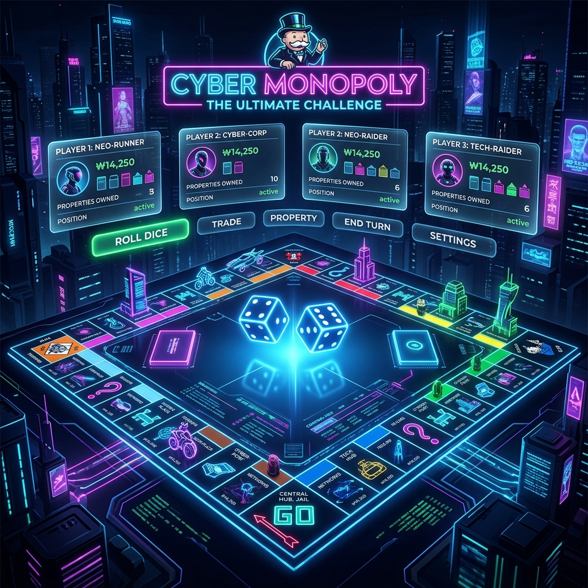
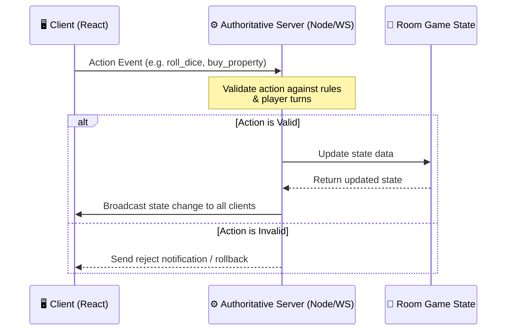
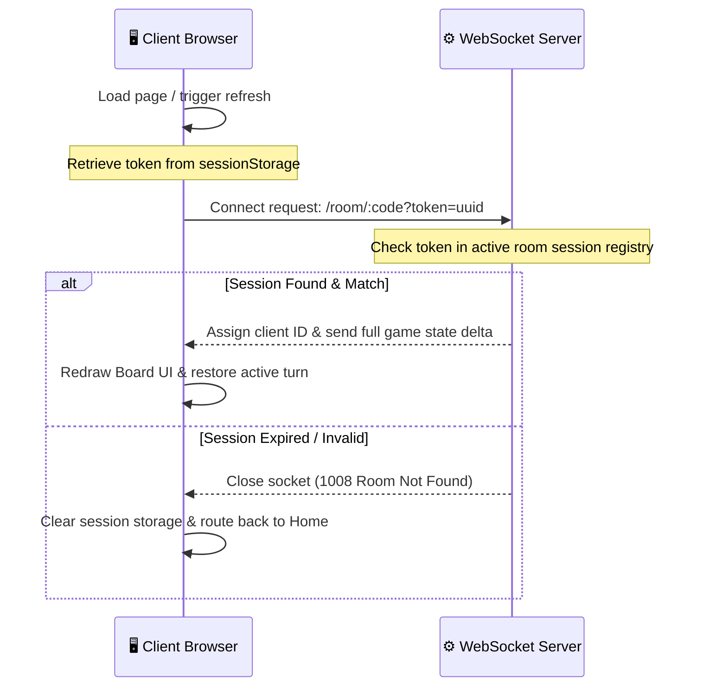

<div align="center">

# 🎲 MONOPOLY MULTIPLAYER 🎲

### 🚀 Fully AI-Remastered & Vibe-Coded Edition
**Experience a sleek, modern, server-authoritative Monopoly game built entirely by AI agents.**

[](https://react.dev)
[](https://nodejs.org)
[](https://www.typescriptlang.org)
[](https://developer.mozilla.org/en-US/docs/Web/API/WebSockets_API)
[](https://gemini.google.com)
[](https://gemini.google.com)

---



</div>

---

## 🤖 The AI Vibe-Coding Statement

> [!IMPORTANT]
> **Every single line of custom code, logic, styling, and asset integration added to this repository since cloning was built autonomously by AI Agents.**
> Using **Claude 4.6 Sonnet** and **Gemini 3.5** inside the **Antigravity IDE**, the game was fully refactored, polished, and upgraded without manual human coding.

The original project was cloned from [itaylayzer/Monopoly](https://github.com/itaylayzer/Monopoly). Through iterative prompting, analysis, and execution, the AI agents transformed a client-side prototype into an ultra-premium, production-ready, multiplayer gaming platform.

---

## 🎮 Key Capabilities & Upgraded Systems

### 📡 1. Server-Authoritative State Sync
To eliminate client desynchronizations, room state cheats, and race conditions, the core state machine was completely rewritten to execute on the Node.js backend.



### 🔄 2. Resilient Session Reconnection & Recovery
Players can safely reload tabs or recover from socket disconnects without breaking active matches.



### 👁️ 3. Spectator Mode
* **Lobby Overfill:** If a game has already started or the lobby is full (max 6 players), players can join as **Spectators**.
* **Seamless Streaming:** Spectators receive real-time board updates, history outputs, and analytics without modifying the game state.

### 🎩 4. Strict Classic Rules Enforcement
* **Property Auctions:** If a player lands on an unowned street and declines to buy it, an interactive property auction triggers for all other active players.
* **Finite Housing Pools:** Standard Monopoly house limits (**32 Houses** and **12 Hotels**). Handles hotel demotions on shortage automatically.
* **Refined Trading Panel:** Reworked trading setup featuring 2-way approval, trade mortgage transfer resolution, and blocks on negative cash trades.
* **Bankruptcy & Debt Resolution:** Automatic debt state management. Declaring bankruptcy triggers asset transfers, balance clearing, and double-confirmation checks.

### 📊 5. Premium Insights Drawer & Luck Index
* **Asset Allocation:** An interactive bottom-drawer details current property value distribution, liquidity ratios, and total asset worth using custom inline SVG progress bars.
* **Luck Index Calculations:** Tracks and computes live dice roll distribution graphs, checking expected roll frequencies against actual rolls to assign a live "Luck Index" to every player.

### 🛠️ 6. Secure QA Sandbox & Debug Console
* A password-secured, collapsible debugger panel allows game testing: force dice values, grant mock assets, trigger instant debt, and manually swap active turns.

---

## 🎨 Aesthetic Upgrades
* **Slate Glassmorphism Theme:** Transparent navigation containers, blur filters, sleek dark backdrops, and modern typography (Outfit / Inter).
* **Mortgaged Stamps:** Mortgaged properties feature a bright styled overlay stamp reading `MORTGAGED` directly on the board tiles.
* **Custom React SVGs:** Completely replaced external icons with inline, high-performance scalable vector assets.

---

## 🚀 Getting Started

The project builds the React app into static files served by the Express backend, running both on a single port to eliminate CORS and cross-origin WebSocket blocks.

### ⚙️ Configuration Setup
1. Create a `.env` file in the project root:
   ```env
   PORT=3064
   ```
2. Configure settings inside [src/config.ts](file:///d:/Games/Monopoly-main/Monopoly-main/src/config.ts):
   ```ts
   export default {
     CODE_PREFIX: "my_monopoly_game",
   };
   ```

### 💻 Running the App

#### Windows (Quick Play)
Simply execute `play.bat` from your file explorer, or run the following in PowerShell/CMD:
```cmd
play.bat
```

#### Linux / macOS
Grant execution rights and launch the script:
```bash
chmod +x start.sh
./start.sh
```

#### Manual Custom Build
If you prefer running build steps manually:
```bash
# 1. Install dependencies
npm install

# 2. Build the client app
npm run build

# 3. Compile backend TS
npm run build:backend

# 4. Start Server
npm start
```
Open your browser at **[http://localhost:3064](http://localhost:3064)**.

#### 🏥 Health & Monitoring
The server exposes a health status endpoint:
* **Endpoint**: `http://localhost:3064/api/health`
* **Response**: Returns JSON containing server status (`UP`), process uptime, active lobbies/rooms count, connected players count, and node process memory footprint details.

---

## 🧪 Test Suite & Continuous Integration

This project uses **Jest** with `ts-jest` for TypeScript test compilation and execution.

### 🏃‍♂️ Running the Tests
To run all test suites locally:
```bash
npm run test
```

### 🔬 What is Tested
1. **Player Logic Unit Tests**: Validates initialization, JSON state serializations/deserializations, and balance modification callbacks.
2. **Board Rent Payouts**: Tests rent calculations for single properties, monopolies (double rent), railroad structures, utility multiplier logic, and mortgaged flags.
3. **GameState Cycles**: Tests asset valuation, property auctions, bankruptcy liquidation logic, and trading rules verification.
4. **WebSocket Routing & Zod Validation**: Mocks client-to-server WebSocket events to verify Zod schema validation blocks malformed actions and safe event wrappers forward errors cleanly.

### ⚙️ GitHub Actions CI Pipeline
A workflow configuration is defined at `.github/workflows/ci.yml`. On every push and pull request to the `main` branch, the pipeline automatically:
- Installs dependencies.
- Enforces syntax conventions via `npm run lint`.
- Verifies TypeScript builds via `npm run type-check`.
- Runs the test suite via `npm run test`.

---

## 🎮 Key Controls & Keyboards

* **`[1-9]` Keys:** Switch through active board navigation drawers.
* **Mouse Scroll:** Rotate the board grid.
* **Shift + Mouse Scroll:** Zoom/scale the board scale size.

---

## 📜 Credits & Disclaimers

### Project Foundations
* Original codebase: [itaylayzer/Monopoly](https://github.com/itaylayzer/Monopoly).
* Credit to [Daniel Stern](https://github.com/danielstern) for the initial `monopoly.json` schema layout.

### Soundtrack Credits
* Main Game Soundtrack: [Monopoly Theme Sound](https://youtu.be/NaH_BiPeZ80)
* Sound effects mastered using Adobe Audition.

### Legal Notice
* **Hasbro Property:** Monopoly is a registered trademark of Hasbro Inc. This project is a non-commercial, open-source educational exercise and is not affiliated with or endorsed by Hasbro.
